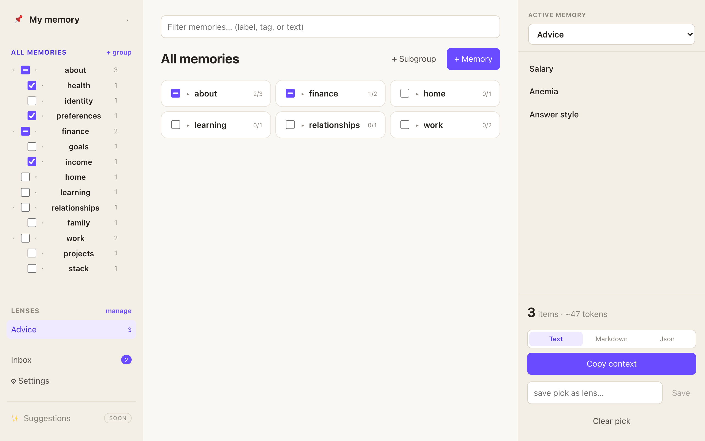
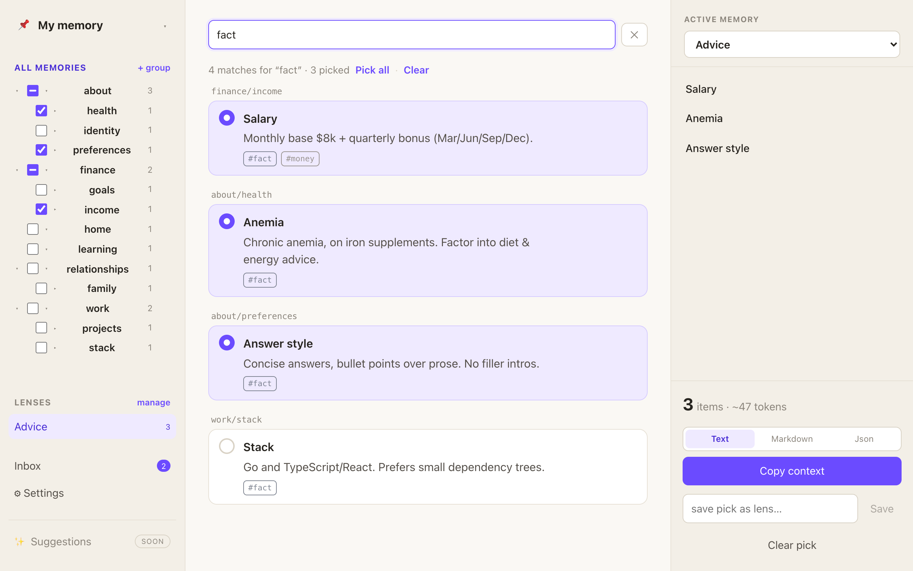
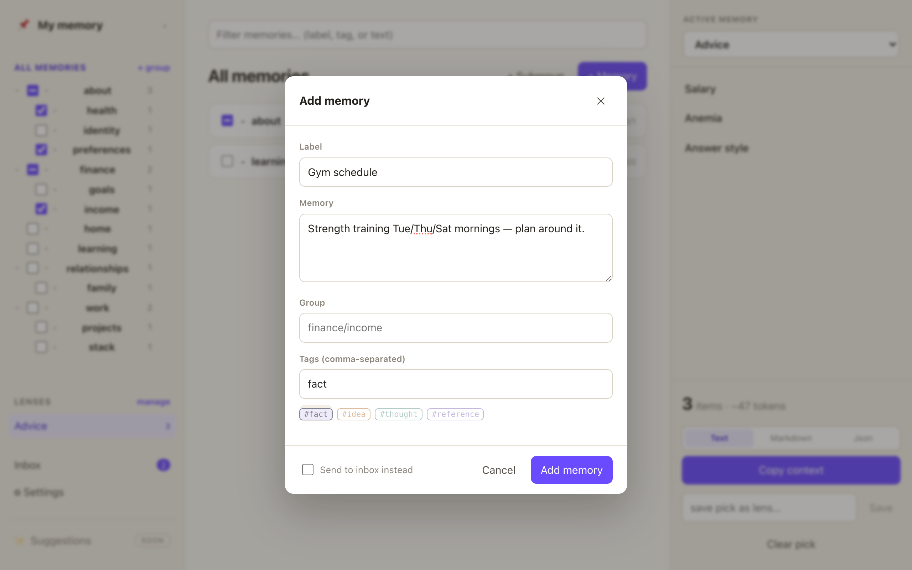
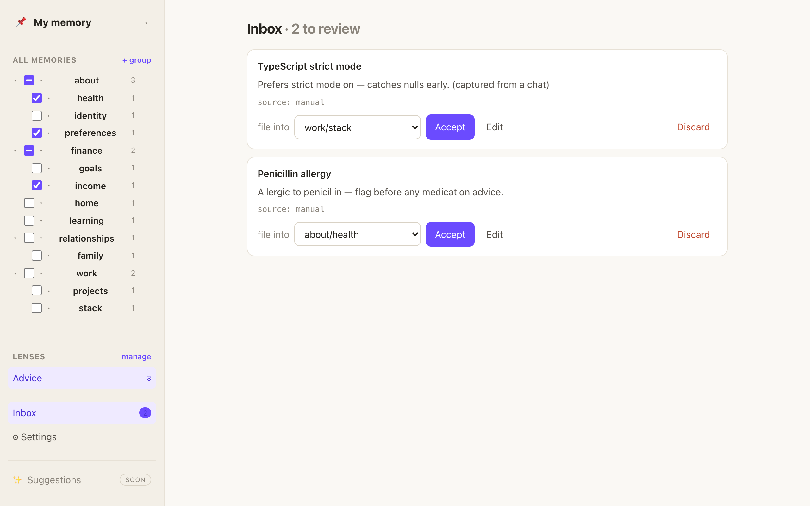
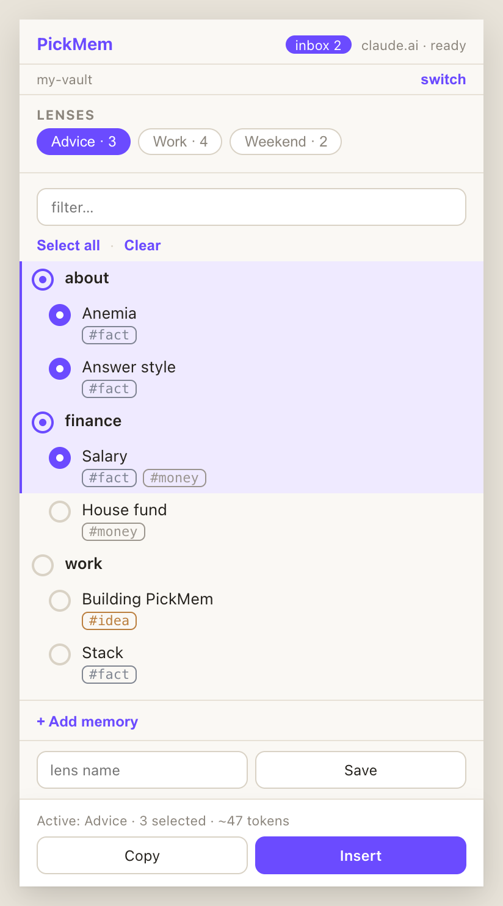

<div align="center">

# 📌 PickMem

### You pick what your AI remembers.

**A local-first memory layer for LLMs.** Your memory is a folder of Markdown you own — and the default is *nothing*. For each task you open a small local web app, pick the slice that reaches the model, and hand it over. No database, no account, no silent injection.

[](LICENSE)
[](go.mod)
[](#-design-principles)
[](https://github.com/kaiagaoo/PickMem/releases/latest)
[](#-take-it-to-your-assistant)

[**Install**](#-get-started) · [**Tour**](#-a-quick-tour) · [**User Guide**](USER_GUIDE.md)

</div>

---

## 👀 What it looks like

`pickmem web` opens a calm three-zone workspace over your own vault: **navigate** on the left, **browse & pick** in the center, and on the right the **Active Memory** tray — *exactly* what the model will receive.

<p align="center"></p>

One click on **Copy context** produces the block below — that, and nothing else, is what your assistant sees:

```
--- pickmem: selected memory (lens: Advice) ---
Salary (finance/income): Monthly base $8k + quarterly bonus (Mar/Jun/Sep/Dec).

Anemia (about/health): Chronic anemia, on iron supplements. Factor into diet & energy advice.

Answer style (about/preferences): Concise answers, bullet points over prose. No filler intros.
--- end pickmem memory ---
```

---

## 🤔 Why PickMem?

Every major assistant now has "memory," and it sometimes makes answers *worse* — pulling in details irrelevant to the question, or quietly leaning on private information you never meant to raise. The root problem is **who holds the controls**: the system decides what's relevant and injects it silently. PickMem flips that one axis — **user-decides-relevance** — and everything else follows:

- **🎯 You decide what the model sees.** The default is nothing; you pick the slice, per task. No system guessing, no silent injection.
- **📂 Your memory is plain Markdown you own.** A folder of notes on your disk, Obsidian-native. No database, no account, no lock-in — readable and portable ten years from now.
- **🔌 One vault, any model.** The same memory reaches Claude, ChatGPT, Gemini, Cursor, and Cline. Switch assistants without leaving your memory behind.

---

## 🧠 How it works

Notes are Markdown files with a small frontmatter header. **Folders are your categories**; colored quick-pick **tags** (`#fact` `#idea` `#thought` `#reference`, or your own) cut across them. Picking writes one small file — `pickmem/active.json` — and every delivery channel reads the same file, so what the model sees never depends on which channel you used:

```
              your memory  (a folder of Markdown notes you own)
                                   │
        pickmem web  ──▶  you pick a slice  ──▶  pickmem/active.json
       (local app in                                     │
        your browser)              ┌─────────────────────┴─────────────────────┐
                                   ▼                                           ▼
                          Chrome extension                            MCP server (stdio)
                     ChatGPT · Claude.ai · Gemini              Claude Desktop · Cursor · Cline
                        (+ copy anywhere)                       (for assistants / AI agents)
```

---

## 🚀 Get started

**One-liner (macOS / Linux):**

```bash
curl -fsSL https://raw.githubusercontent.com/kaiagaoo/PickMem/main/install.sh | sh
```

Detects your OS/arch, verifies the checksum, installs the binary to `/usr/local/bin` (or `~/.local/bin` without sudo), **and** unpacks the Chrome extension to `~/.local/share/pickmem/extension`. The web UI is embedded in the binary — nothing to build. That's everything: web + extension in one command. <sub>Windows: grab the `_windows_amd64.zip` from the [releases page](https://github.com/kaiagaoo/PickMem/releases/latest). From source: `go install ./cmd/pickmem` (Go 1.26+).</sub>

Then:

```bash
pickmem init ~/PickMemVault   # 1. create a vault (a plain folder — your only store)
pickmem web                   # 2. build, organize, and pick in the browser
```

The app opens at `http://127.0.0.1:4577`. A brand-new vault greets you with a short setup guide; a vault with notes drops you straight into the workspace. Full walkthrough: **[USER_GUIDE.md](USER_GUIDE.md)**.

---

## 📸 A quick tour

**Find and pick across your whole vault.** The filter searches labels, tags, and text; results are pickable cards that show where each memory lives:

<p align="center"></p>

**Adding a memory is one small form.** File it into a group (type a new path to create one), and tag it with one click — suggested tags are just ordinary tags you can customize in Settings:

<p align="center"></p>

**AI can propose; only you approve.** Tell a connected Claude *"remember that I'm allergic to penicillin"* and it stages the fact to your **Inbox**, routed to a suggested group. Nothing goes live until you accept it:

<p align="center"></p>

---

## 🔌 Take it to your assistant

**Chrome extension** — pick from a compact popup and **Insert** the block straight into ChatGPT, Claude.ai, or Gemini (clipboard fallback everywhere else). It reads the same vault and the same pick as the web app:

<p align="center"></p>

If you installed via the one-liner, the extension is already unpacked at **`~/.local/share/pickmem/extension`** — just open `chrome://extensions` → enable **Developer mode** → **Load unpacked** → pick that folder. (Re-running the installer refreshes it in place; reload the extension afterward.) From a clone, build it instead:

```bash
cd extension && npm install && npm run build
#   then load extension/dist/ via chrome://extensions → Load unpacked
```

**MCP server** — `pickmem serve` is a stdio MCP server for native clients. It exposes the picked slice (`get_active_memory`, `pickmem://active`), lens tools, and `stage_memories` for AI-proposed memories that land in your inbox:

```bash
pickmem install claude-desktop      # or: cursor   (writes the client config for you)
```

**CLI** — everything also works headless (`pickmem add`, `pick`, `import`, `review`, `context --copy`, …) for scripts and agents. See the [command reference](USER_GUIDE.md#13-command-reference).

---

## 🔒 Design principles

These are enforced invariants, not aspirations:

- **Local-first, no exceptions.** Your vaults stay on disk; PickMem makes no network calls. The web app binds to `127.0.0.1` only.
- **Create-only.** PickMem creates notes and files inbox items into folders. It never rewrites a note you authored without a guard — it verifies on-disk content first and refuses if the file changed under it.
- **The user decides relevance.** No silent auto-injection. AI extraction only ever *proposes* into an inbox; nothing goes live without your review.
- **Deterministic lookup, not RAG.** A picked item is fetched by id — an exact read, not a similarity guess.
- **You own the taxonomy.** Your folder tree defines your categories, and you choose which reach the model.

---

## 🛠️ Development

```bash
go test ./... && go vet ./...        # Go core
cd webapp && npm install && npm run build     # SPA → internal/web/static/ (embedded; build before go build)
cd ../extension && npm test && npm run build  # MV3 extension → extension/dist/
```

The vault format — Markdown-with-frontmatter notes plus a few small JSON files (`active.json`, `lenses.json`, `config.json`) — is the stable contract shared by every surface (web, extension, MCP, CLI/TUI).

## 📄 License

[MIT](LICENSE) © 2026 Kaia Gao
